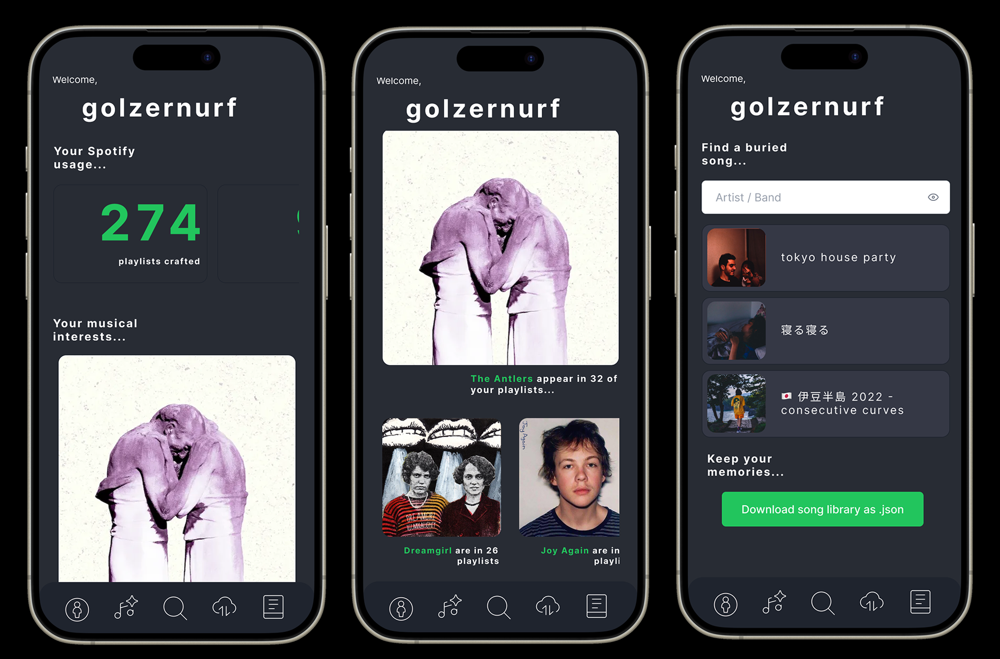

# Spotify Tools

A web application that offers concise set of tools designed to help users interact with Spotify. 

Built from personal needs based on how I use Spotify. Feel free to request features in the [project issues](https://github.com/Kayra/spotify-tools/issues).

## Design



### Feature ideas:
* Find playlists that contain provided song
* Back up playlists as text file
* Song timeline
* Playlist analysis
  - Top 5 genres (with %s)
  - Top artists

### Technologies used:
* [Fastapi](https://fastapi.tiangolo.com)
* [Python Spotify Wrapper (Spotipy)](https://github.com/plamere/spotipy)
* [Typescript](https://www.typescriptlang.org)
* [React](https://reactjs.org)
* [Spotify API](https://developer.spotify.com/documentation/web-api/)
* [Docker/Compose](https://www.docker.com)

## Development Application Installation and Use

**Ensure you have Docker installed to run the application locally.**

Install the application:

```bash
make install
```

Start the application (after installation):

```bash
make start
```

Connect to the API Docker container bash (while the application is running):

```bash
make api-shell
```

Connect to the API Mongo client (while the application is running):

```bash
make mongo-shell
```

Connect to the client Docker container shell (while the application is running):

```bash
make client-shell
```

Build and run the production client Docker container (accessible at [http://localhost:8001](http://localhost:8001)):

```bash
docker build --no-cache -t spotify-client . && docker run -p 80:80 spotify-client
```

---

Be sure to import the [insomnia](https://insomnia.rest) client project in [docs/Insomnia_2021-08-21.json](docs/Insomnia_2021-08-21.json) to quickly get started with making requests to the API.
